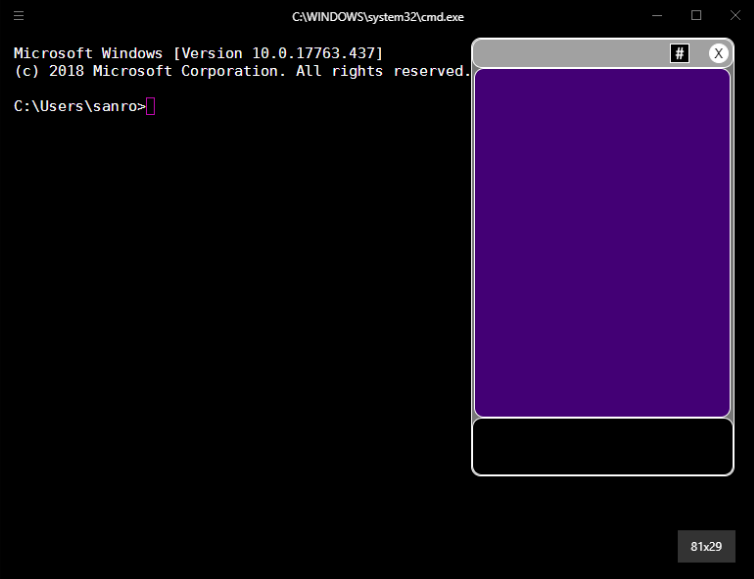

Extension for [Hyper](https://hyper.is) that let's you read Slack channel history and send messages to public channels through a closable chat window.

## How to use

Install [Hyper](https://hyper.is) and add `hyper-slack`
to `plugins` in `~/.hyper.js` and restart hyper.js.
